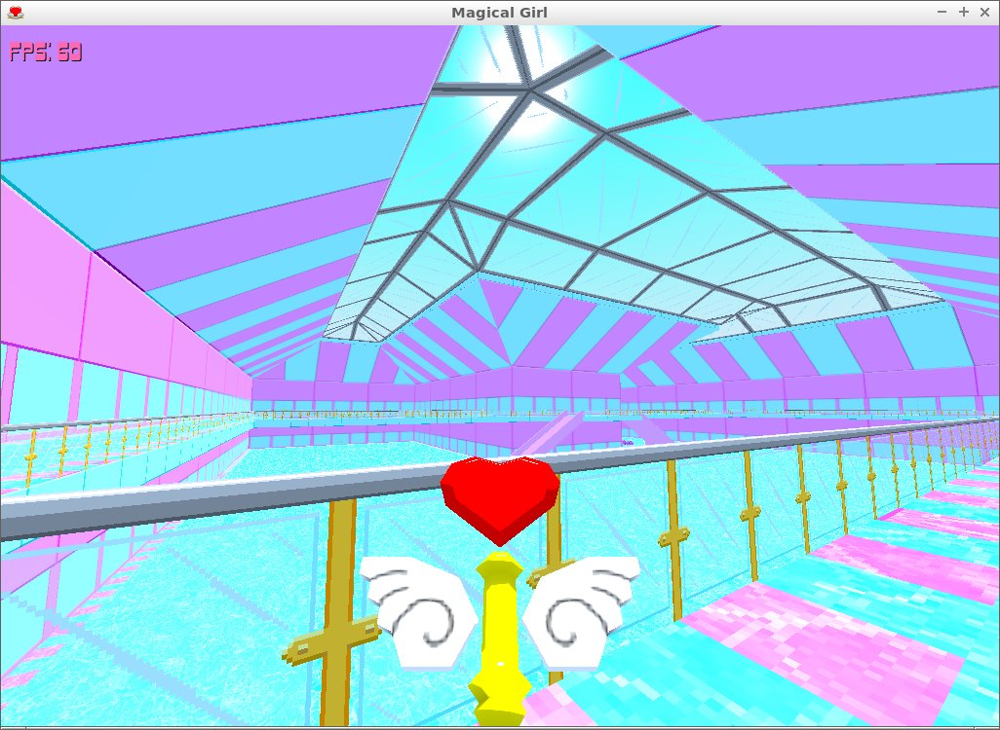
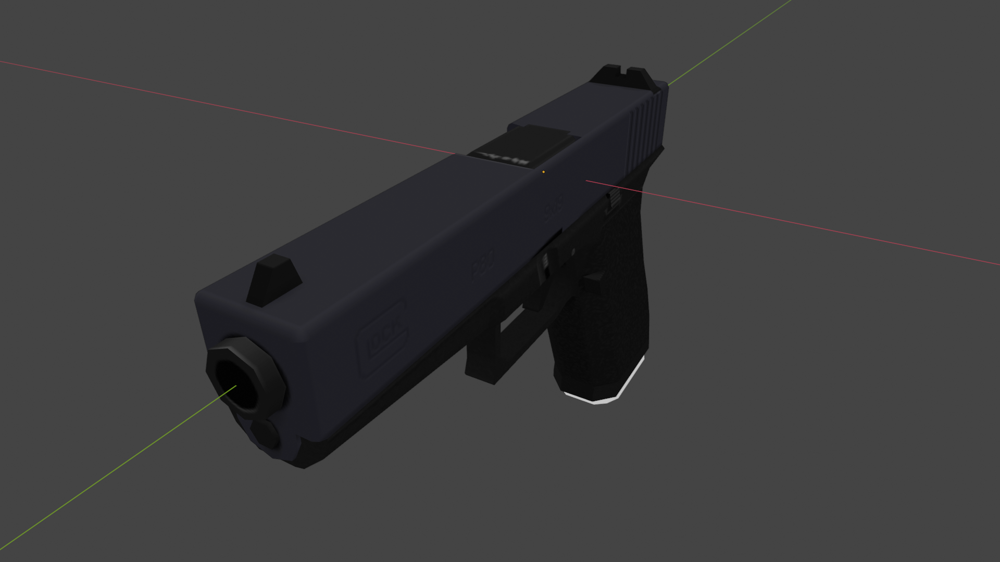
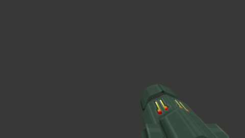
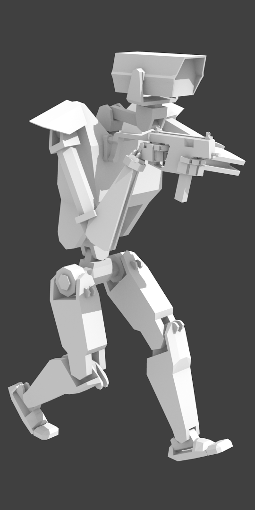
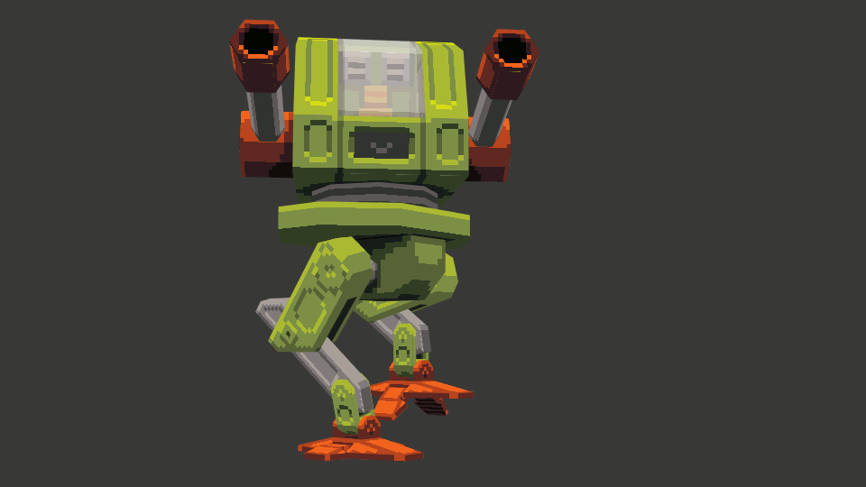
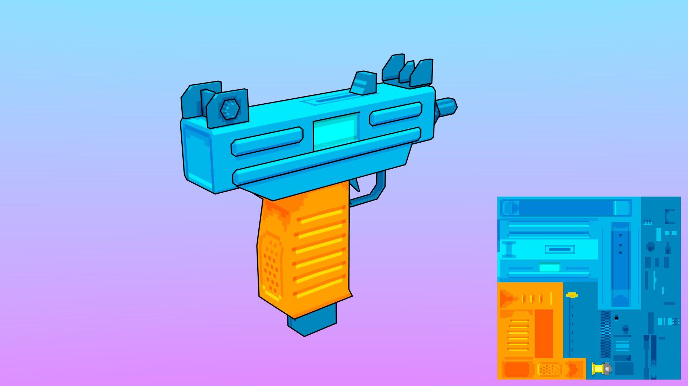

---

My name is Christopher DeBoy, and I'm an aspiring game developer and graphic designer/artist. I'm most familiar with the Godot Game Engine and its GDScript scripting language, having worked with it for over 8 years and developed quite a few comprehensive systems in it. **If you're interested in hiring me, [feel free to reach out](https://8bitprodigy.github.io/#contact)**  

Here's a list of languages I'm most familiar with:

- GDScript
- C/C++
- Nim
- Python
- HTML5, CSS3, & JavaScript

Here are some links to my profiles:

- [Github Profile](https://github.com/8bitprodigy)
- [Codeberg Profile](https://codeberg.org/chris_deboy)
- [San Bernardino Operation on Codeberg](https://codeberg.org/San_Bernardino_Operation)
- [Itch.io](https://8bitprodigy.itch.io/)
- [LinkedIn](https://www.linkedin.com/in/christopher-deboy-0aa48278/)

**Portfolio Sections:**

- [Contact info](https://8bitprodigy.github.io/#contact)
- [Programming](https://8bitprodigy.github.io/#programming)
- [3D Art & Animation](https://8bitprodigy.github.io/#3d_art_animation)
- [Graphic Design](https://8bitprodigy.github.io/#graphic_design)

---

## Contact

---

# Programming

---

### [Godot FPS Controller](https://github.com/8bitprodigy/WestMonster_FPS_Base)

<video id="fps_controller" controls>
        <source src="videos/fps_controller_1.mp4" type="video/mp4" />
</video>

        <a id="fps_1" href="#FPS_CONTROLLER" onclick="changeVideoSrc('fps_controller', 'fps_controller_1')">
                Demo 1
        </a>
        &emsp;|&emsp;
        <a id="fps_2" href="#FPS_CONTROLLER" onclick="changeVideoSrc('fps_controller', 'fps_controller_2')">
                Demo 2
        </a>
        &emsp;|&emsp;
        <a id="fps_3" href="#FPS_CONTROLLER" onclick="changeVideoSrc('fps_controller', 'fps_controller_3')">
                Demo 3
        </a>

This is a first person shooter controller I made in the Godot engine. I got pretty far along and it includes the following features:

- Walking, stair-stepping, crouching, leaning, sprinting, sneaking, jumping, Source Engine-style ladder climbing, and swimming
- Head-bobbing dependent upon speed and ambulation type
- Procedural weapon sway, bobbing, and inertia
- Weapons have procedural vertical and horizontal muzzle climb, recoil, accuracy, and precision settings.
- Bullet spread can be affected by how long you fire. If the barrel overheats, that could permanently affect accuracy and precision.
- Bullets are projectiles that travel through space over time and are affected by gravity. Their trajectory is determined when they're fired.
- Bullets leave material-dependent decals on impact -- wood splinters, metal dents, glass cracks, dirt craters, etc...
- Buttons, dials, doors, and gates are available as interactable elements and can have their inputs and outputs chained together like in the Source Engine.

---

### [Mech Controller Demo](https://github.com/8bitprodigy/mech_demo)

<video controls>
        <source src="videos/mech_controller.mp4" type="video/mp4" />
</video>

This is a mech controller demo I created in the Godot game engine. It is a minimal proof-of-concept and includes the following features:

- Tank reticle to show leg orientation relative to turret orientation
- Aiming is driven by mouse direction, rather than mapped directly to mouse movement.
- movement is relative to leg orientation. Legs are rotated by key inputs.
- Thrusters/jet pack
- Skybox and endless plane visualizer

---

### [6DOF Controller Demo](https://github.com/8bitprodigy/6DOF_Demo)

<video id="6dof_controller" controls>
        <source src="videos/6dof_demo_1.mp4" type="video/mp4" />
</video>

        <a id="6dof_1" href="#6DOF_CONTROLLER" onclick="changeVideoSrc('6dof_controller', '6dof_demo_1')">
                Demo 1
        </a>
        &emsp;|&emsp;
        <a id="6dof_2" href="#6DOF_CONTROLLER" onclick="changeVideoSrc('6dof_controller', '6dof_demo_2')">
                Demo 2
        </a>

This is a six degrees of freedom (like in the Descent series) controller demo I created in the Godot game engine. It is a minimal proof-of-concept and includes the following features:

- Six degrees of rotation
- Angular inertia
- Movement along all 3 axes relative to orientation
- Networked player controllers
- Skybox

---

### [RZZNNV2N]([RZZNNV2N by 8bitprodigy](https://8bitprodigy.itch.io/rzznnv2n))

This is a simple challenge game I made, where you navigate a helicopter through a gauntlet of challenges, increasing in difficulty with each level. Made in Godot 2.X, it was a sequel to my prior game, [RZZNNVZN](https://8bitprodigy.itch.io/rzznnvzn), which was made in JavaScript using [MelonJS](https://melonjs.org/).

---

### Magical Girl FPS

        <a id="mgirl_0" href="#MGIRL" onclick="changeImgSrc('MGIRL', '3d/magical_girl.jpg')">
                Mall hub level
        </a>
        &emsp;|&emsp;
        <a id="mgirl_1" href="#MGIRL" onclick="changeImgSrc('MGIRL', '3d/magical_girl-0.jpg')">
                Firing
        </a>
        &emsp;|&emsp;
        <a id="mgirl_2" href="#MGIRL" onclick="changeImgSrc('MGIRL', '3d/magical_girl-1.jpg')">
                After firing for a bit
        </a>
        &emsp;|&emsp;
        <a id="mgirl_3" href="#MGIRL" onclick="changeImgSrc('MGIRL', '3d/magical_girl-3.jpg')">
                Some world models I had made
        </a>
        &emsp;|&emsp;
        <a id="mgirl_4" href="#MGIRL" onclick="changeImgSrc('MGIRL', '3d/magical_girl_staff.jpg')">
                The heart wand
        </a>

This was a magical girl-themed FPS I was working on in Godot. Unfortunately, I'm unable to launch the project, so these images are all that I have of it. In this game, you could play as 3 different magical girls, each one having their own wand and movement mechanic. Movement mechanics were activated with the jump key while airborne.

**Wands:**

- **Ice Wand** - fires ice crystals like a shotgun
- **Earth Wand** - fires a stream of flower petals like a machine gun. As the wand fires, the stream of petals spirals outward.
- **Heart Wand** - Was to fire an explosive, but wasn't implemented yet.

**Movement types:**

- **Double Jump** - an extra jump in midair
- **Glide** - descent is slowed with increased horizontal movement
- **Dive** - accelerate for a short burst in the direction you're moving

---

### 3D Gauntlet-like

        <a id="gaunt_0" href="#GAUNT" onclick="changeImgSrc('GAUNT', '3d/3d_gauntlet_wiz_skelly.jpg')">
                Fighting Skeletons as the Wizard
        </a>
        &emsp;|&emsp;
        <a id="gaunt_1" href="#GAUNT" onclick="changeImgSrc('GAUNT', '3d/3d_gauntlet_barbarian_ghosts.jpg')">
                Fighting ghosts as the Barbarian
        </a>
        &emsp;|&emsp;
        <a id="gaunt_2" href="#GAUNT" onclick="changeImgSrc('GAUNT', '3d/3d_gauntlet.jpg')">
                Items
        </a>
        &emsp;|&emsp;
        <a id="gaunt_3" href="#GAUNT" onclick="changeImgSrc('GAUNT', '3d/3d_gauntlet_potion.jpg')">
                Potion
        </a>
        </a>

This was a 3D Gauntlet-style game I was working on that the project seems to have been lost to time. I had a character select screen and a single level that you could play through complete with pickup items, unlockable doors, destroyable walls, items to pick up, enemies, and an exit. Unfortunately, these are the only two pictures of it I can find at the moment.

**UPDATE:** I have found the project files and put the models up under the public domain at [Itch.io](https://8bitprodigy.itch.io/public-domain-dungeon-themed-models)!

---

### [GameBoy Color DVD Screensaver demo### ](https://8bitprodigy.github.io/)

<video controls>
        <source src="videos/gb_dvd_screensaver.mp4" type="video/mp4" />
</video>

This is a simple demo I made using GBDK to get familiar with the library. It features a DVD Video logo as a metasprite that bounces around the screen and changes color on collision.

---

### [GameBoy Roguelike](https://codeberg.org/chris_deboy/GameBoy_Roguelike)

<video controls>
        <source src="videos/gb_roguelike.mp4" type="video/mp4" />
</video>

This is a work-in-progress roguelike I've been working on for the GameBoy in C and GBDK. It's pretty early on, but the basic skeleton of dungeon generation is implemented.

---

### [NRPNC](https://github.com/8bitprodigy/nrpnc)

This is an RPN (Reverse Polish Notation) calculator in Nim. It operates with a stack-based language with if/else statements, variables, and function declaration, which should, in theory, make it turing-complete.

---

### [N.U.T.E.](https://github.com/8bitprodigy/nute)

The Nim Unstructured/Useless Text Editor. This is a line text editor I made as an exercise to learn Nim and make use of its built in types. It stores a document line by line in an AVL tree, and it makes editing the text document much like entering a program into an 80's microcomputer. To enter text, you type the number for its line, followed by a space, and then the text you wish to enter. If there's a line number collision, it replaces the old line, but if not, it's entered into the AVL tree, which then self-balances.

---

[AtlasWM](https://codeberg.org/San_Bernardino_Operation/AtlasWM)

This is the Atlas Window Manager. AtlasWM aims to be a lightweight, but featureful, and user-friendly window manager for X11, based on Joe's Window Manager (JWM), that only uses permissively-licensed code and libraries, as it will be the default window manager for AcephalOS and eventually PrometheusOS.  

Currently, I've replaced Cairo/libRSVG with [PlutoSVG](https://github.com/sammycage/plutosvg), and have enhanced the customizability of the motif theme to enable greater readability, and am currently working on replacing Pango/XFT with [libSchrift](https://github.com/tomolt/libschrift). I intend to extend its features, with some of the main ones being tababble windows, like in Haiku or FluxBox, and a global menu panel item.  

AtlasWM is currently in alpha stages, and most planned features are not yet implemented. Many things are likely subject to change, so it is not recommended for daily use.

---

## 3D Art & Animation

Some 3D models I've worked on, some of which are animated. This is an incomplete list.

---

### Glock 17

        <a id="glock_1" href="#GLOCK" onclick="changeImgSrc('GLOCK', '3d/glock/3qfl.png')">
                3-Quarter front left
        </a>
        &emsp;|&emsp;
        <a id="glock_1" href="#GLOCK" onclick="changeImgSrc('GLOCK', '3d/glock/3qfr.png')">
                3-Quarter front right
        </a>
        &emsp;|&emsp;
        <a id="glock_1" href="#GLOCK" onclick="changeImgSrc('GLOCK', '3d/glock/3qrl.png')">
                3-Quarter rear left
        </a>
        &emsp;|&emsp;
        <a id="glock_1" href="#GLOCK" onclick="changeImgSrc('GLOCK', '3d/glock/3qrr.png')">
                3-Quarter rear right
        </a>
        &emsp;|&emsp;
        <a id="glock_1" href="#GLOCK" onclick="changeImgSrc('GLOCK', '3d/glock/front.png')">
                Front
        </a>
        &emsp;|&emsp;
        <a id="glock_1" href="#GLOCK" onclick="changeImgSrc('GLOCK', '3d/glock/rear.png')">
                Rear
        </a>
        &emsp;|&emsp;
        <a id="glock_1" href="#GLOCK" onclick="changeImgSrc('GLOCK', '3d/glock/side_l.png')">
                Left
        </a>
        &emsp;|&emsp;
        <a id="glock_1" href="#GLOCK" onclick="changeImgSrc('GLOCK', '3d/glock/side_r.png')">
                Right
        </a>
        &emsp;|&emsp;
        <a id="glock_1" href="#GLOCK" onclick="changeImgSrc('GLOCK', '3d/glock/locked_l.png')">
                Locked open, left
        </a>
        &emsp;|&emsp;
        <a id="glock_1" href="#GLOCK" onclick="changeImgSrc('GLOCK', '3d/glock/locked_r.png')">
                Locked open, right
        </a>
        &emsp;|&emsp;
        <a id="glock_1" href="#GLOCK" onclick="changeImgSrc('GLOCK', '3d/glock/under_slide.png')">
                Under slide
        </a>
        &emsp;|&emsp;
        <a id="glock_1" href="#GLOCK" onclick="changeImgSrc('GLOCK', '3d/glock/Glock17.png')">
                Texture
        </a>

Rigged Glock 17 3D model I was working on in Blender, texture made in Inkscape and GIMP.

---

### The New Retro Show intro

<video id="tnrs_intro" controls>
        <source src="videos/newretro.mp4" type="video/mp4" />
</video>

Intro sequence I made for the YouTube channel [The New Retro Show](https://www.youtube.com/@thenewretroshow).

---

### Metal Jesus Rocks intro

<video id="mjr_intro" controls>
        <source src="videos/mjr_intro.mp4" type="video/mp4" />
</video>

An intro sequence I made for the YouTube channel [MetalJesusRocks](https://www.youtube.com/@MetalJesusRocks/). Unfortunately, I do not recall the video it was used in.

---

### Arm Cannon

        <a id="samus_1" href="#SAMUS" onclick="changeImgSrc('SAMUS', '3d/arm_cannon/animations.gif')">
                Animations
        </a>
        &emsp;|&emsp;
        <a id="samus_2" href="#SAMUS" onclick="changeImgSrc('SAMUS', '3d/arm_cannon/3Q.png')">
                3-Quarter clay render
        </a>
        &emsp;|&emsp;
        <a id="samus_2" href="#SAMUS" onclick="changeImgSrc('SAMUS', '3d/arm_cannon/3QOpen.png')">
                3-Quarter clay render, open
        </a>
        &emsp;|&emsp;
        <a id="samus_2" href="#SAMUS" onclick="changeImgSrc('SAMUS', '3d/arm_cannon/fpView.png')">
                First person clay render
        </a>
        &emsp;|&emsp;
        <a id="samus_2" href="#SAMUS" onclick="changeImgSrc('SAMUS', '3d/arm_cannon/fpViewOpen.png')">
                First person clay render, open
        </a>
        &emsp;|&emsp;
        <a id="samus_2" href="#SAMUS" onclick="changeImgSrc('SAMUS', '3d/arm_cannon/front.png')">
                Front clay render
        </a>
        &emsp;|&emsp;
        <a id="samus_2" href="#SAMUS" onclick="changeImgSrc('SAMUS', '3d/arm_cannon/side.png')">
                Side clay render
        </a>
        &emsp;|&emsp;
        <a id="samus_2" href="#SAMUS" onclick="changeImgSrc('SAMUS', '3d/arm_cannon/top.png')">
                Top clay render
        </a>
        &emsp;|&emsp;
        <a id="samus_2" href="#SAMUS" onclick="changeImgSrc('SAMUS', '3d/arm_cannon/armCannonTex.png')">
                Texture
        </a>
        &emsp;|&emsp;
        <a id="samus_2" href="#SAMUS" onclick="changeImgSrc('SAMUS', '3d/arm_cannon/3QTex3.png')">
                3-Quarter textured
        </a>
        &emsp;|&emsp;
        <a id="samus_2" href="#SAMUS" onclick="changeImgSrc('SAMUS', '3d/arm_cannon/3QOpenTex3.png')">
                3-Quarter textured, open
        </a>
        &emsp;|&emsp;
        <a id="samus_2" href="#SAMUS" onclick="changeImgSrc('SAMUS', '3d/arm_cannon/fpViewTex3.png')">
                First person textured
        </a>
        &emsp;|&emsp;
        <a id="samus_2" href="#SAMUS" onclick="changeImgSrc('SAMUS', '3d/arm_cannon/sideTex3.png')">
                Side textured
        </a>

Samus Aran arm cannon I made for a Quake Mod I was working on. Made using forward kinematics.

---

### Robot

        <a id="robot_1" href="#ROBOT" onclick="changeImgSrc('ROBOT', '3d/ROBOT_ANIM_C0.gif')">
                Walking, ready
        </a>
        &emsp;|&emsp;
        <a id="robot_2" href="#ROBOT" onclick="changeImgSrc('ROBOT', '3d/ROBOT_ANIM_D.gif')">
                Crouch-walking, ready
        </a>
        &emsp;|&emsp;
        <a id="robot_3" href="#ROBOT" onclick="changeImgSrc('ROBOT', '3d/ROBOT_ANIM4.gif')">
                Walking, no gun
        </a>

A robot model I created, inspired by some outdoor security cameras I saw around my hometown. Makes uses of Forward and Inverse kinematics.

---

### Star Raiders

        <a id="star_1" href="#STAR" onclick="changeImgSrc('STAR', '3d/MechWalk1.gif')">
                Mech, Walking
        </a>
        &emsp;|&emsp;
        <a id="star_2" href="#STAR" onclick="changeImgSrc('STAR', '3d/MechWalk.gif')">
                Mech, Walking, alternate view 1
        </a>
        &emsp;|&emsp;
        <a id="star_3" href="#STAR" onclick="changeImgSrc('STAR', '3d/MechWalk0.gif')">
                Mech, Walking, alternate view 2
        </a>
        &emsp;|&emsp;
        <a id="star_4" href="#STAR" onclick="changeImgSrc('STAR', '3d/hmv_pic3.png')">
                HMV
        </a>
        &emsp;|&emsp;
        <a id="star_5" href="#STAR" onclick="changeImgSrc('STAR', '3d/tank_pic9.png')">
                Tank
        </a>
        &emsp;|&emsp;
        <a id="star_6" href="#STAR" onclick="changeImgSrc('STAR', '3d/turret_1.png')">
                Sentry turret
        </a>
        &emsp;|&emsp;
        <a id="star_7" href="#STAR" onclick="changeImgSrc('STAR', '3d/jet.jpg')">
                Jet with Texture
        </a>

Various models I made for a game I was working on with a friend called "Star Raiders"(Working title). Animated using forward kinematics.

---

### Various Guns

        <a id="guns_1" href="#GUNS" onclick="changeImgSrc('GUNS', '3d/muziSnapTex.png')">
                Micro-Uzi
        </a>
        &emsp;|&emsp;
        <a id="guns_2" href="#GUNS" onclick="changeImgSrc('GUNS', '3d/render2cb.png')">
                Kriss Vektor
        </a>
        &emsp;|&emsp;
        <a id="guns_3" href="#GUNS" onclick="changeImgSrc('GUNS', '3d/sgunSnapshotWTEX.png')">
                Ithaca 37 Stakeout
        </a>
        &emsp;|&emsp;
        <a id="guns_4" href="#GUNS" onclick="changeImgSrc('GUNS', '3d/texturedShadedRender3.png')">
                AR-15
        </a>
        &emsp;|&emsp;
        <a id="guns_5" href="#GUNS" onclick="changeImgSrc('GUNS', '3d/render6-.png')">
                FAMAS, untextured
        </a>
        &emsp;|&emsp;
        <a id="guns_3" href="#GUNS" onclick="changeImgSrc('GUNS', '3d/render.png')">
                Recoilless Rifle, clay render
        </a>
        &emsp;|&emsp;
        <a id="guns_3" href="#GUNS" onclick="changeImgSrc('GUNS', '3d/render8.png')">
                Saiga-12, untextured
        </a>

Various low-poly, stylized weapon models I have created over the years.

---

### Wallpapers

        <a id="wallpaper_1" href="#WALLPAPER" onclick="changeImgSrc('WALLPAPER', '3d/goreEffectHD_glow.png')">
                Synthwave Terrain
        </a>
        &emsp;|&emsp;
        <a id="wallpaper_2" href="#WALLPAPER" onclick="changeImgSrc('WALLPAPER', '3d/goreEffectHD_glow1.jpg')">
                Synthwave Terrain, alternate glow
        </a>
        &emsp;|&emsp;
        <a id="wallpaper_3" href="#WALLPAPER" onclick="changeImgSrc('WALLPAPER', '3d/vaporscapeColorSolids_8.png')">
                Synthwave Color Solids
        </a>
        &emsp;|&emsp;
        <a id="wallpaper_4" href="#WALLPAPER" onclick="changeImgSrc('WALLPAPER', '3d/burger4.png')">
                RetroWave fast food
        </a>

Various retro/synthwave desktop wallpapers I've created in Blender3D.

---

# Graphic Design

---

### [Liver](https://github.com/8bitprodigy/liver)

This is the typeface used throughout this document. Liver is a public-domain sans-serif font in the style of Goma/Shin-Go/Rodin/Saira, modeled with screens in mind.  

Comes in regular and mono variants. Bold variant in the works.

---

## Logos

#### AcephalOS logo

Logo I made for a FreeBSD-based OS I am working on.

#### San Bernardino Operation logo

Logo I made for the organization to work on AcephalOS.

#### ioRTCW

#### Old ioQuake3 logo

#### The Gore Effect Facebook logo

In addition to the above logos, all other logos on this page were designed by myself.
